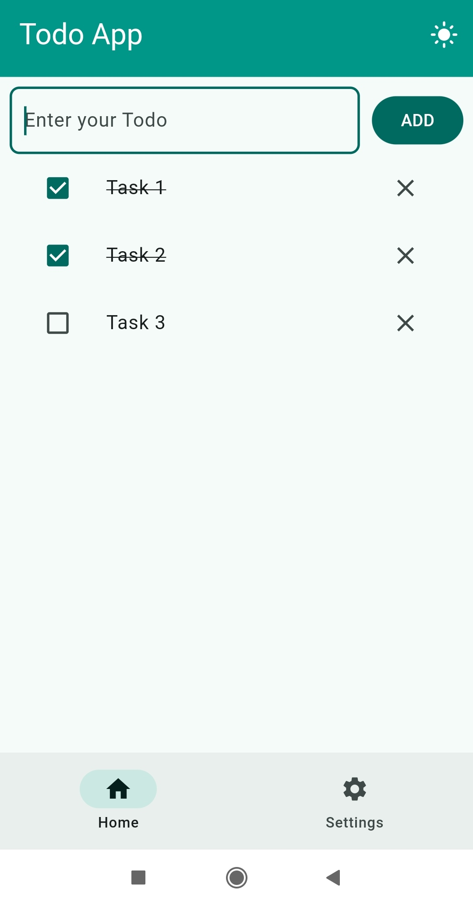

# Flutter Todo App

A simple and clean Todo list application built with Flutter. This project demonstrates core Flutter concepts including state management with `ValueNotifier`, local data persistence using `SharedPreferences`, and a toggle-able light/dark mode.

## 📸 Screenshots

[▶️ Watch the demo video](/download/preview.mp4)




### Download:
[Download Apk](https://drive.google.com/file/d/1WAj41aDPS2_YpfHK4DcD0yYWfOptqQ6U/view?usp=drive_link)

## ✨ Features

* **Create Todos:** Easily add new tasks to your list.
* **Complete Todos:** Mark tasks as done with a checkbox.
* **Delete Todos:** Remove tasks you no longer need.
* **Persistent Storage:** Your todo list is saved locally using `SharedPreferences` and reloads every time you open the app.
* **Dark Mode:** A beautiful dark mode that can be toggled from the app bar.
* **Safe Exit:** Prompts with a confirmation dialog before exiting the app on Android.

## 🛠️ Tech Stack & Concepts

This project was built using:

* **Flutter:** The UI toolkit for building the app.
* **Dart:** The programming language.
* **ValueNotifier:** For simple, reactive state management.
* **shared_preferences_async:** To save and load data locally on the device.
* **json.encode / json.decode:** Used to serialize and deserialize the `Todo` list for storage.
* **SharePlus:** Sharing app

## Key Concepts Learned

This project was a great learning experience. Key takeaways include:

* **Strongly-Typed Models:** Moving from `List<Map<String, dynamic>>` to a custom `Todo` class to ensure type safety.
* **Model Serialization:** Using `toMap()` and a `factory Todo.fromMap()` constructor to handle JSON conversion.
* **State Management:** Using `ValueNotifier` and `ValueListenableBuilder` to separate UI from business logic and rebuild widgets efficiently.
* **Local Persistence:** Reading and writing data to `SharedPreferences` for both the todo list and the theme preference.
* **App Lifecycle:** Loading critical data (like the theme) in `main.dart` *before* `runApp()`.
* **Code Structure:** Separating logic into different files like services (`prefs_service.dart`), models (`todo_model.dart`), and notifiers (`notifiers.dart`).

## 🚀 Getting Started

To run this project locally:

1.  Clone the repository:
    ```bash
    git clone https://github.com/iamvkr/flutter-todo-app.git
    cd flutter-todo-app
    ```

2.  Get dependencies:
    ```bash
    flutter pub get
    ```

3.  Run the app:
    ```bash
    flutter run
    ```

A few resources to get you started if this is your first Flutter project:

- [Lab: Write your first Flutter app](https://docs.flutter.dev/get-started/codelab)
- [Cookbook: Useful Flutter samples](https://docs.flutter.dev/cookbook)

For help getting started with Flutter development, view the
[online documentation](https://docs.flutter.dev/), which offers tutorials,
samples, guidance on mobile development, and a full API reference.
